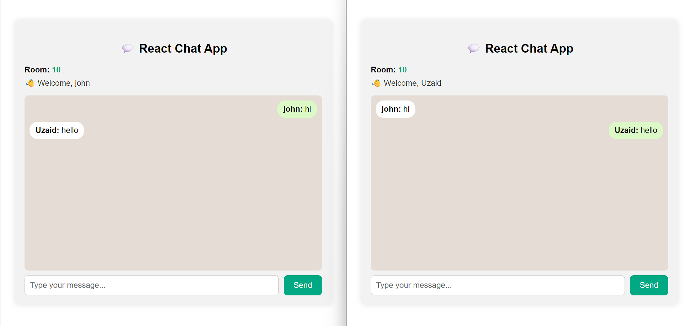
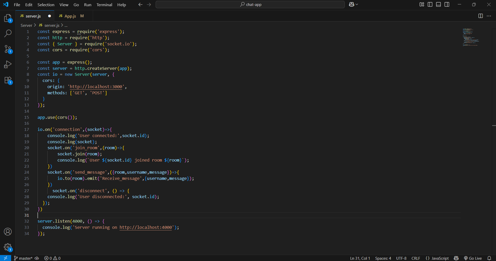
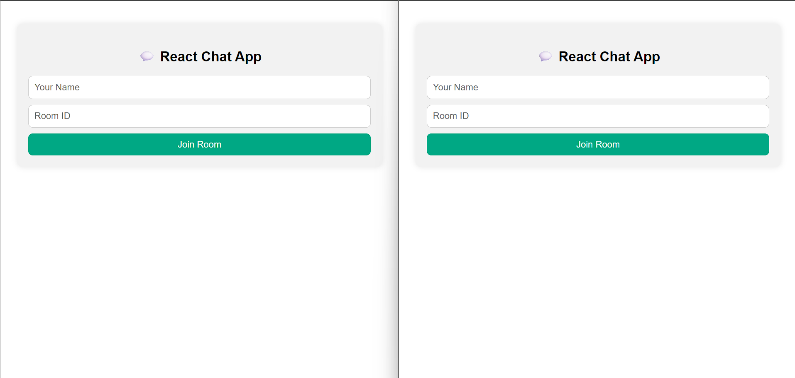

# 💬 React Socket.IO Chat App (with Rooms)

A real-time chat application built using **React**, **Node.js**, and **Socket.IO** where users can join different rooms and chat live — just like WhatsApp group chats 🔥.

---

## 🚀 Features

- 🔐 Join any room by Room ID
- 🧑 Username support in every message
- 💬 Real-time messaging with WebSockets (Socket.IO)
- 📱 WhatsApp-style styled frontend
- 🎨 Auto-align messages (yours on right, others on left)
- 📸 Screenshot previews in README

---

## 🖼️ Screenshots

###  💬 Chat UI 

### 💻

### 🧑 Joining Page

---

## 🔧 Tech Stack

| Frontend | Backend |
|----------|---------|
| React.js | Node.js |
| HTML/CSS | Express |
| Socket.IO | Socket.IO |

---
